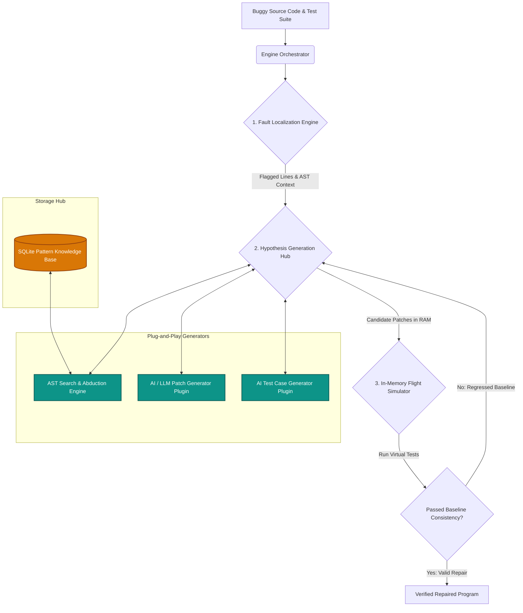

# AbinDebugger Architecture

This document outlines the system architecture of `AbinDebugger`, a high-performance, robust, and extensible automated program repair platform. 

---

## 1. Design Philosophy:

* **Test in RAM:** Candidate fixes are evaluated entirely inside virtual memory without ever touching the hard drive.
* **Self-Contained:** The platform requires zero external background services or daemons, utilizing embedded storage for maximum portability.
* **Modular Design:** Built around a headless, event-driven pipeline, allowing intelligent modules (like AI-Assisted Test Generation or LLM Code Reviewers) to integrate via standard I/O with zero friction.

---

## 2. Core Architectural Pillars

### Pillar A: Pure In-Memory Sandboxing
Instead of utilizing OS-level file loaders for patch evaluation, the engine manipulates Python syntax trees (ASTs) strictly in memory. Candidate ASTs are compiled directly to bytecode (`compile()`) and executed inside isolated virtual namespaces. 
* **Advantage:** Eliminates file overwriting race conditions, prevents `sys.modules` contamination, and allows the engine to evaluate hundreds of candidate repairs per second safely.

### Pillar B: Portable Embedded Storage
Pattern storage and retrieval are handled by an embedded **SQLite JSONB** database (`repair_knowledge.db`).
* **Advantage:** The entire repair database is a single, portable local file. A user or CI/CD runner can install the tool and immediately repair code offline without configuring or authenticating a background document database.

### Pillar C: Low-Overhead SBL Tracing
Fault localization tracks code coverage at near-native interpreter execution speeds by utilizing modern Python 3.12+ **`sys.monitoring`** (PEP 669), bypassing the massive execution penalties associated with legacy `sys.settrace` hooks.

---

## 3. High-Level Architecture Diagram

